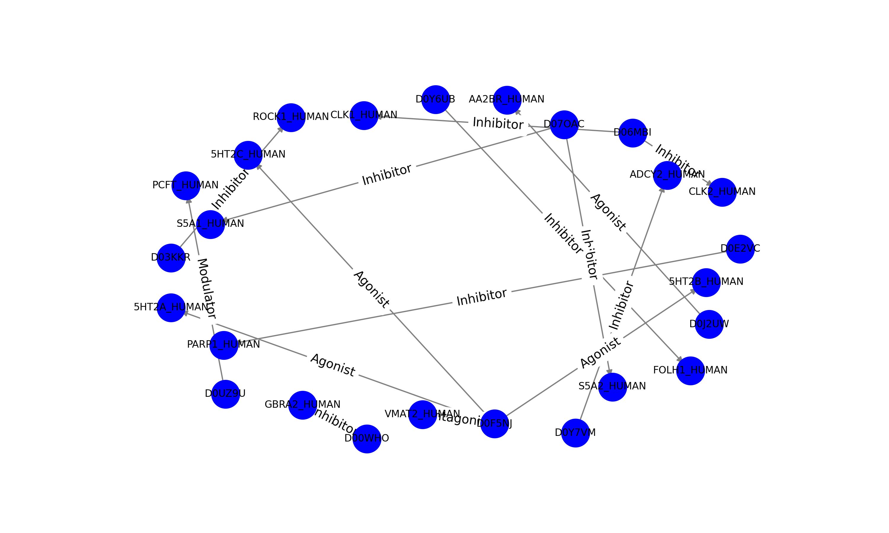

# graphbasedloading

## Introduction
This is a project from the CMU/DNAnexus Hackathon 2023, in which we are improving LLMs’ inferences for drug treatment recommendations by fine-tuning them with knowledge graphs.

## Research Motivation
Given that LLMs can answer queries quickly and efficiently, they could be useful in recommending drug treatments for various diseases, where time is of the essence. However, as their training data may be factually incorrect or outdated, LLMs are often unreliable in recommending drug treatments. 

Knowledge graphs can store factually correct relationships between data points, giving them the ability to answer complex queries. Hence, we believe that fine-tuning LLMs with knowledge graphs could aid LLMs in recommending drug treatments.

## Preliminary Workflow
```mermaid
graph LR;
  A["Small-scale experiments
  following LLM & KG paper"]
  B["Generate a few hundred
   relationship graph for a
   small scale experiment"]
  D["Load raw graph data (e.g. Drugbank)"]
  C["Encode entire graph in
    triple form as text
    LLM context"]
  X["Use KG based context for
fact based grounding"]
  E{"Graph fits in
context window?"}
  F["Generate query for
 relevant triples"]
  G["Extract triples from graph"]
  H{"Small enough for
context window?"}
  I["Hierarchically refine
query prompt with triples"]
  A-->D
  B-->D
  D-->E
  E-->|Yes|C
  C-->X
  E-->|No|F
  F-->G
  G-->H
  H-->|Yes|X
  H-->|No|I
  I-->F
```

## Methodology
**Dataset**: 44,663 drug-relationship-target triplets were compiled from the Therapeutic Target Database[4], which are in “drug_relationship_target.csv”. URL to database: https://db.idrblab.net/ttd/ 

**Preprocessing**: The triplets were preprocessed into a prompt-response format for LLAMA2 in “inputdata.txt”.

<!-- Training and Inference: A LLAMA2-7b model was then fine-tuned on the preprocessed data. -->
**Fine-tuning**: Within fine-tuning techniques, traditional approaches usually require retraining the last layers of the LLMs which would cost a huge amount of computational cost. To overcome this issue, we implemented QLora, an efficient parameter tuning method that uses Low Rank Adaptation and Double Quantization to reduce the training and inference cost. Using the knowledge graph dataset represented as triplets as shown above, we were able to fine tune LLMs-7B on a NVIDIA Tesla A100 within 2 hours.

**Deployment**: Our fine-tuned model LLaMA2Glenda is deployed at https://huggingface.co/spaces/tminh/nexus

**Inference**: Finally, our fine-tuned model was benchmarked as shown [here](https://github.com/tanchongmin/TensorFlow-Implementations/blob/main/Tutorial/LLM%20with%20Knowledge%20Graphs.ipynb)

## References
1. Pan, S., Luo, L., Wang, Y., Chen, C. et al. Unifying Large Language Models and Knowledge Graphs: A Roadmap. 20 June 2023, https://doi.org/10.48550/arXiv.2306.08302  
Tim Dettmers, Artidoro Pagnoni, Ari Holtzman, Luke Zettlemoyer. 

2. QLoRA: Efficient Finetuning of Quantized LLMs. 23 May 2023, https://arxiv.org/pdf/2305.14314.pdf  

3. Edward J. Hu, Yelong Shen, Phillip Wallis, Zeyuan Allen-Zhu, Yuanzhi Li, Shean Wang, Lu Wang, Weizhu Chen. LoRA: Low-Rank Adaptation of Large Language Models, https://arxiv.org/pdf/2106.09685.pdf 

4. Y. Zhou, Y. T. Zhang, D. H. Zhao, X. Y. Yu, X. Y. Shen, Y. Zhou, S. S. Wang , Y. Q. Qiu*, Y. Z. Chen* & F. Zhu* . TTD: Therapeutic Target Database describing target druggability information. Nucleic Acids Research. doi: 10.1093/nar/gkad751 (2023). PMID: 37713619
